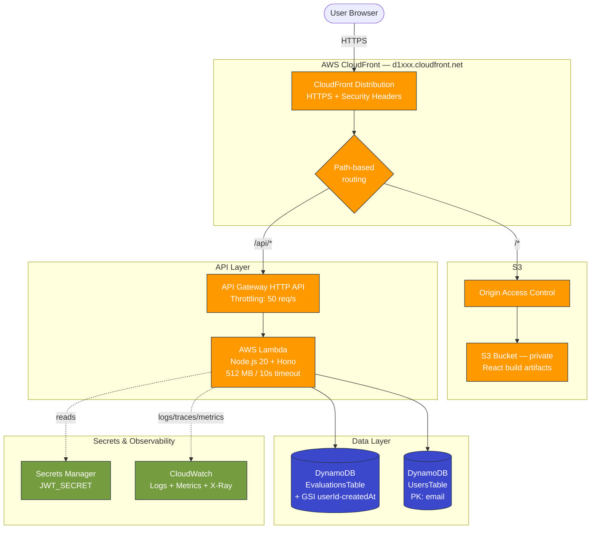

# System Architecture

High-level view of all AWS services, their connections, and request flow.

## Key design points

- **Single origin (CloudFront)** — frontend and `/api/*` share one domain → `SameSite=Strict` cookies work, zero CORS configuration
- **Private S3 + OAC** — bucket has Block Public Access ON; only CloudFront can read via signed Origin Access Control
- **One Lambda** — single function handles all routes via Hono router; hexagonal composition wired once at cold start
- **Multi-table DynamoDB** — Users and Evaluations are independent aggregates; multi-table chosen for readability over single-table design
- **Secrets Manager** — JWT signing key stored as auto-generated secret; rotated independently of code deploys
- **CloudWatch** — structured JSON logs (Lambda Powertools), X-Ray distributed tracing, custom metrics per endpoint
