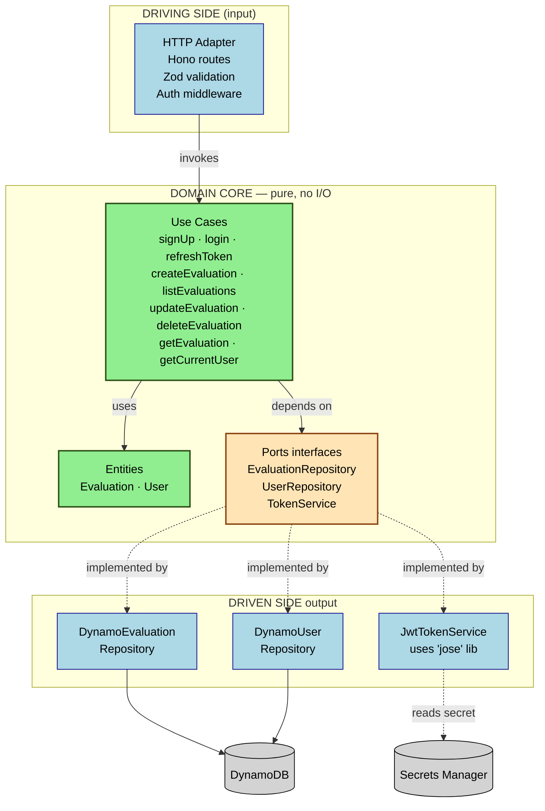

# Hexagonal Architecture (Ports & Adapters)

The backend follows Alistair Cockburn's hexagonal architecture: the **domain** is pure business logic with no awareness of AWS, HTTP, or databases. It communicates with the outside world through **ports** (interfaces), and concrete **adapters** implement those ports.



## Why hexagonal here

| Benefit | How it pays off |
|---|---|
| **Domain has zero AWS imports** | Use cases are pure TypeScript — testable without mocking AWS SDK |
| **Live demo: swap an adapter** | If reviewer asks "what if we switch to PostgreSQL?", I delete `DynamoEvaluationRepository`, write `PostgresEvaluationRepository`, change one line in `composition.ts`. Domain untouched. |
| **Live demo: add a field** | Touches `Evaluation.ts` entity + `schemas.ts` Zod schema. Repository persists whatever the entity has (uses DocumentClient with object mapping). |
| **Tests run fast** | Domain unit tests have no I/O, no Docker, no mocks — pure function calls. |
| **Composition root pattern** | `composition.ts` is the ONLY file that knows how the pieces fit. Swapping implementations or wiring test doubles happens in one place. |

## Dependency direction (the critical rule)

**All arrows point INWARD toward the domain.** The domain never imports from `adapters/` or `http/`. The HTTP layer imports use cases. Adapters implement port interfaces defined in the domain. This is enforced by:

- ESLint rule: `no-restricted-imports` blocks `domain/*` files from importing `adapters/*` or `http/*` or `@aws-sdk/*`
- Folder convention: anything in `domain/` is pure; anything that touches I/O lives in `adapters/`

## File-level example

```typescript
// domain/evaluation/EvaluationRepository.ts (PORT — interface only)
export interface EvaluationRepository {
  save(e: Evaluation): Promise<void>;
  findById(id: string): Promise<Evaluation | null>;
  listByUser(userId: string, filters: ListFilters): Promise<PaginatedResult>;
  update(id: string, patch: Partial<Evaluation>, expectedUserId: string): Promise<Evaluation>;
  softDelete(id: string, expectedUserId: string): Promise<void>;
}

// adapters/persistence/DynamoEvaluationRepository.ts (ADAPTER)
export class DynamoEvaluationRepository implements EvaluationRepository {
  constructor(private tableName: string, private client = ddbDocClient) {}
  async save(e: Evaluation) { /* PutCommand */ }
  async findById(id: string) { /* GetCommand */ }
  // ...
}

// domain/use-cases/createEvaluation.ts (USE CASE — no AWS, no HTTP)
export function createEvaluation(deps: { repo: EvaluationRepository }) {
  return async (input: CreateInput) => {
    const evaluation = Evaluation.create(input);
    await deps.repo.save(evaluation);
    return evaluation;
  };
}

// composition.ts (COMPOSITION ROOT — wiring)
const repo = new DynamoEvaluationRepository(process.env.EVALUATIONS_TABLE!);
const createUseCase = createEvaluation({ repo });
// then injected into Hono routes
```
