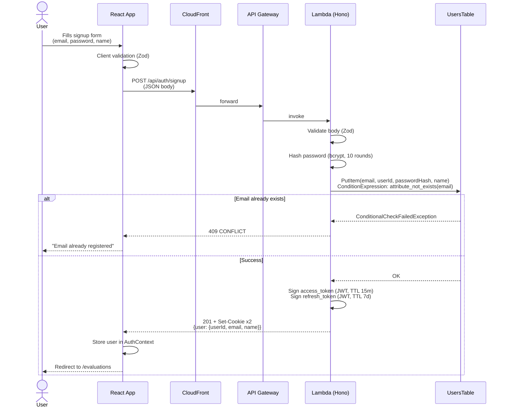
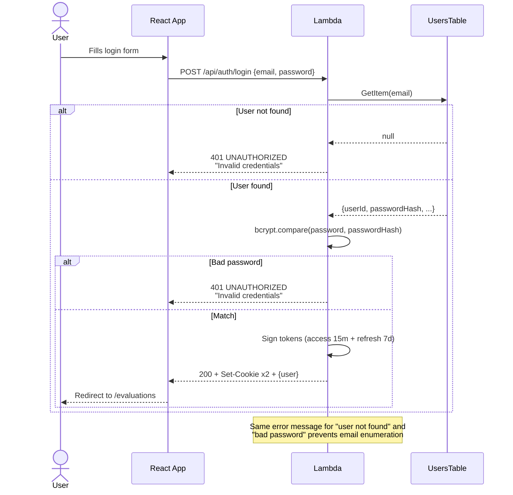
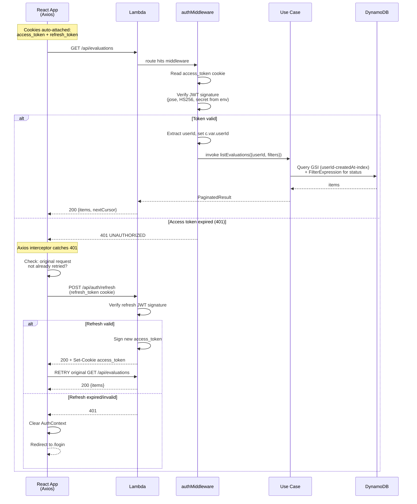

# Auth Flow Sequence Diagrams

Four critical auth flows: **signup**, **login**, **authenticated request with auto-refresh**, and **logout**.

---

## 1. Signup



---

## 2. Login



---

## 3. Authenticated request with auto-refresh

This is the most important flow — defends decision §2.6 (stateless refresh).



### Why this flow is safe (Q&A defense)

- **httpOnly cookies** → JavaScript cannot read them; XSS payloads cannot exfiltrate tokens
- **SameSite=Strict** → browser refuses to send cookies on cross-site requests; CSRF impossible
- **Secure** → only sent over HTTPS (enforced by CloudFront)
- **Same-origin topology** → no `Access-Control-Allow-Credentials` needed, no preflight churn
- **Stateless refresh** → no DB lookup on every refresh; signature verification only
- **Short access TTL (15m)** → window of exposure if a token somehow leaks is bounded
- **Idempotent refresh** → axios interceptor uses a single-flight promise so concurrent 401s share one refresh call

---

## 4. Logout

```mermaid
sequenceDiagram
    actor U as User
    participant FE as React App
    participant L as Lambda

    U->>FE: Clicks "Logout"
    FE->>L: POST /api/auth/logout
    L-->>FE: 204 + Set-Cookie<br/>access_token=; Max-Age=0<br/>refresh_token=; Max-Age=0
    FE->>FE: Clear AuthContext<br/>queryClient.clear()
    FE-->>U: Redirect to /login

    note over L: Logout is decorative on the server side.<br/>Tokens remain technically valid until TTL expires,<br/>but the client has no way to present them again.<br/>If forced server-side invalidation were needed,<br/>we would add a RefreshTokens table (decision §2.6).
```
