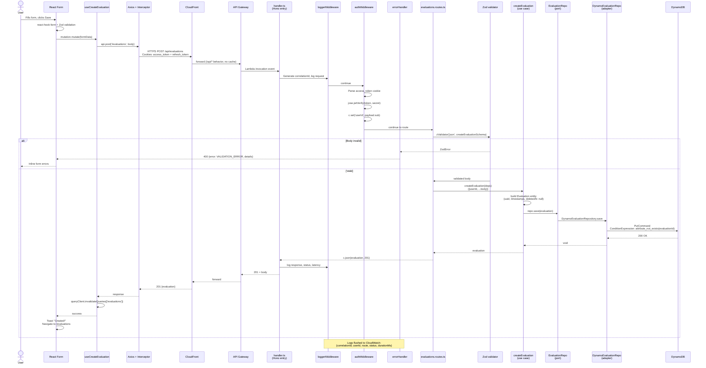

# CRUD Request Lifecycle

How a single request flows through every architectural layer. This diagram is what you walk the reviewer through during the demo to show separation of concerns.

## Example: `POST /api/evaluations`

## What each layer does (and what it doesn't)

| Layer | Responsibility | Does NOT |
|---|---|---|
| **React Form** | Capture user input, client-side validation | Know about HTTP details |
| **Hook (TanStack Query)** | Mutation, cache invalidation, optimistic updates | Know about auth/refresh |
| **Axios + interceptor** | HTTP transport, automatic token refresh on 401 | Know about business logic |
| **CloudFront** | TLS termination, routing by path, security headers | Touch business logic |
| **API Gateway** | Throttling, request transformation, Lambda invocation | Touch business logic |
| **handler.ts** | Lambda entry, Hono dispatch | Know about specific use cases |
| **loggerMiddleware** | Correlation ID, structured request/response logs | Touch business logic |
| **authMiddleware** | Verify JWT, extract userId | Decide who can do what |
| **Route handler** | Validate input (Zod), call use case, map response | Contain business rules |
| **Use case** | Orchestrate business logic, enforce invariants | Know about HTTP, DynamoDB |
| **Port (interface)** | Define what the domain needs from persistence | Contain implementation |
| **Adapter (DynamoRepo)** | Translate domain operations to DynamoDB calls | Contain business logic |
| **DynamoDB** | Store and query data | Validate business rules |

## Why this matters for the demo

When the reviewer says *"walk me through what happens when a user creates an evaluation"*, you can point at this diagram and trace the entire path in 90 seconds. Every layer has one job, and the boundary between domain and infrastructure is enforced by the folder structure and the import rules.

When the reviewer says *"what if validation rules change?"*, you point at one file: `schemas.ts`. When they say *"what if we switched databases?"*, you point at `DynamoEvaluationRepository` and explain that the domain wouldn't change.
