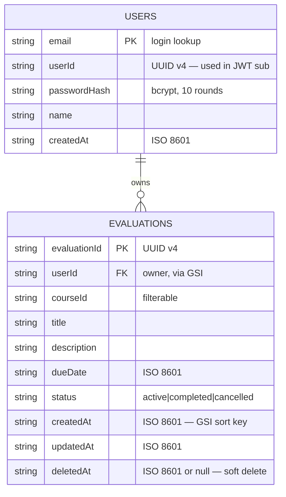

# Data Model (DynamoDB)

Multi-table design — Users and Evaluations are independent aggregates.

## ER diagram

## Table specs

### `EvaluationsTable`

| Attribute | Type | Role |
|---|---|---|
| `evaluationId` | String | **Primary key (HASH)** |
| `userId` | String | GSI hash key |
| `courseId` | String | filterable |
| `title` | String | |
| `description` | String | |
| `dueDate` | String | ISO 8601 |
| `status` | String | enum |
| `createdAt` | String | GSI range key |
| `updatedAt` | String | |
| `deletedAt` | String \| null | soft delete |

**Global Secondary Index: `userId-createdAt-index`**

| Attribute | Role |
|---|---|
| `userId` | HASH (partition key) |
| `createdAt` | RANGE (sort key) |
| Projection | ALL |

### `UsersTable`

| Attribute | Type | Role |
|---|---|---|
| `email` | String | **Primary key (HASH)** — direct lookup on login |
| `userId` | String | UUID v4, referenced by JWT and EvaluationsTable |
| `passwordHash` | String | bcrypt |
| `name` | String | |
| `createdAt` | String | |

## Access pattern matrix

| Use case | Operation | Index | Notes |
|---|---|---|---|
| Signup | `PutItem` on Users | base | `ConditionExpression: attribute_not_exists(email)` → 409 on duplicate |
| Login | `GetItem` on Users | base | by `email` |
| Get current user | `GetItem` on Users | base | by `email` from JWT |
| Create evaluation | `PutItem` on Evaluations | base | `ConditionExpression: attribute_not_exists(evaluationId)` |
| Get evaluation | `GetItem` on Evaluations | base | by `evaluationId`; use case checks `userId` matches token |
| List user's evaluations | `Query` on Evaluations | **GSI** | hash=`userId`, scan-forward false (newest first), `FilterExpression` for `status`, `courseId`, `deletedAt = null`, pagination via `ExclusiveStartKey` |
| Update evaluation | `UpdateItem` on Evaluations | base | `ConditionExpression: userId = :uid AND attribute_not_exists(deletedAt)` |
| Soft delete | `UpdateItem` on Evaluations | base | `SET deletedAt = :now` with `ConditionExpression: userId = :uid AND attribute_not_exists(deletedAt)` |

## Why this design

| Decision | Reasoning |
|---|---|
| **Email as PK on Users** | Login is the dominant access pattern; direct `GetItem` avoids a GSI |
| **GSI on userId+createdAt** | All list operations are user-scoped and want newest first |
| **FilterExpression for status/courseId** | These are low-cardinality filters; at scale we'd consider sparse indexes, but at this scope FilterExpression is correct and cheap |
| **Soft delete via deletedAt** | Allows recovery, audit, and reporting on deleted items without a separate archive table |
| **No relationships enforced** | DynamoDB is not relational; ownership enforced at the application (use case) layer |
| **No `RefreshTokens` table** | See decision §2.6 — stateless refresh tokens |

## Capacity & cost

- **Billing mode:** `PAY_PER_REQUEST` (on-demand) — Free Tier covers up to 25 WCU + 25 RCU equivalents for the first 12 months
- **Estimated cost:** $0 for the test (well under Free Tier)
- **TTL:** none on either table (we don't expire users or evaluations)
