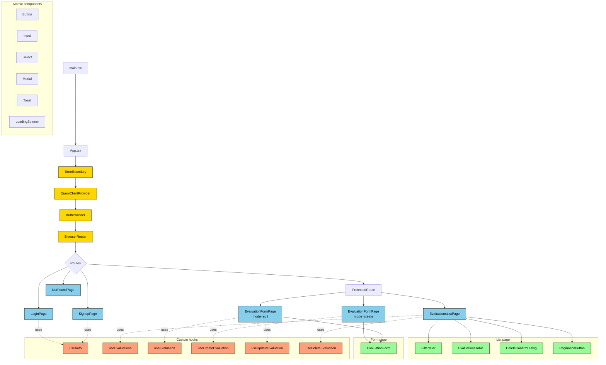

# Frontend Component Tree

React app structure showing component hierarchy, contexts, and data flow.



## Provider chain (top to bottom)

```
<ErrorBoundary>           ← catches React render errors, shows fallback UI
  <QueryClientProvider>   ← TanStack Query cache, dev tools
    <AuthProvider>        ← Context: { user, isLoading, login, logout, signup }
      <BrowserRouter>     ← React Router v6
        <Routes>
          ... pages
        </Routes>
      </BrowserRouter>
    </AuthProvider>
  </QueryClientProvider>
</ErrorBoundary>
```

## Routing rules

| Path | Component | Guard |
|---|---|---|
| `/login` | `LoginPage` | redirects to `/evaluations` if already authed |
| `/signup` | `SignupPage` | redirects to `/evaluations` if already authed |
| `/` | redirect to `/evaluations` | – |
| `/evaluations` | `EvaluationsListPage` | wrapped in `<ProtectedRoute>` |
| `/evaluations/new` | `EvaluationFormPage` (create) | wrapped in `<ProtectedRoute>` |
| `/evaluations/:id/edit` | `EvaluationFormPage` (edit) | wrapped in `<ProtectedRoute>` |
| `*` | `NotFoundPage` | – |

## Data flow patterns

### Reading
```
Page component → useEvaluations() hook → TanStack Query
  ↓ (if not cached)
QueryFn → api.get('/evaluations') → backend
  ↓
Response cached + returned
  ↓
Component re-renders with data, loading, error states
```

### Writing
```
Form submit → useCreateEvaluation() mutation
  ↓
mutation.mutate(formData)
  ↓
api.post('/evaluations', data) → backend
  ↓ on success
queryClient.invalidateQueries(['evaluations']) → list refetches
  ↓
toast.success("Created!") + navigate('/evaluations')
```

### Auto-refresh on 401
```
Any request → 401 response
  ↓
Axios response interceptor catches it
  ↓
Single-flight: POST /auth/refresh (shared promise across concurrent 401s)
  ↓ on success
Retry the original request with new cookie
  ↓ on failure
authContext.logout() + redirect to /login
```

## Why this structure

- **Pages are thin** — they compose hooks and components but contain no business logic
- **Hooks own data fetching** — every API interaction goes through a custom hook; components never call axios directly
- **Atomic components** — shared `Button`, `Input`, `Select`, `Modal` enforce consistent UI
- **Single form for create/edit** — `EvaluationForm` takes a `mode` prop and an optional `initialValues`; cuts maintenance in half
- **Protected route HOC** — auth check lives in one place; if `useAuth().user` is null, redirect to `/login`
